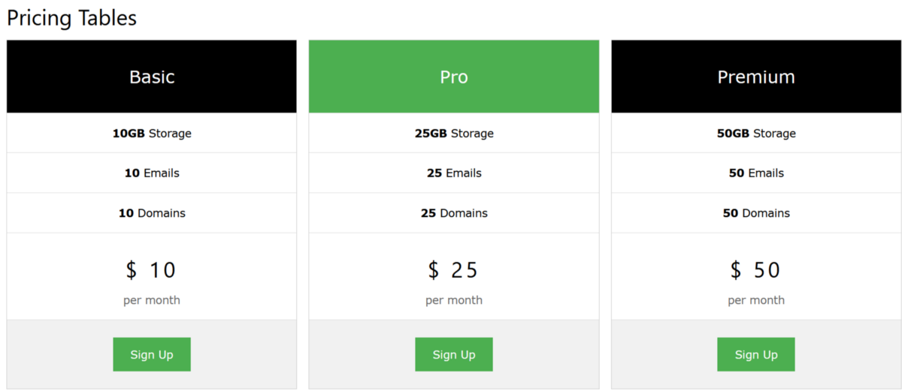
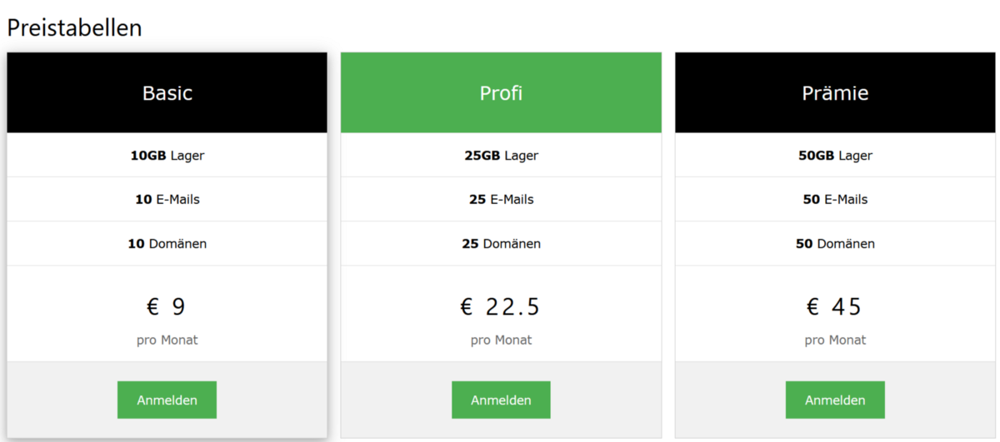

# Node.js Tutorial on Creating a Multilingual Web App
This repository contains the source code for creating a multilingual web application in Node.js, without the need to install any external localization or internationalization library.

# Glob
Glob is a library to match files using the patterns the shell uses, such as stars and stuff.

    npm install glob

# Language Files
Language files will be stored in the JSON data format, which is convertible into JavaScript objects.

    {
      "pricing_table": "Pricing Tables",
      "basic": "Basic",
      "pro": "Pro",
      "premium": "Premium",
      "storage": "Storage",
      "email": "Emails",
      "domain": "Domains",
      "sign_up": "Sign Up",
      "cost_basic": "$ 10",
      "cost_pro": "$ 25",
      "cost_premium": "$ 50",
      "per_month": "per month"
    }

# Running Node.js server

    node index.js

# Loading the web app in your browser
Simply modify the url based on the language code.

    http://localhost:8080/en

For German internationalization, go to the following url

    http://localhost:8080/de

